
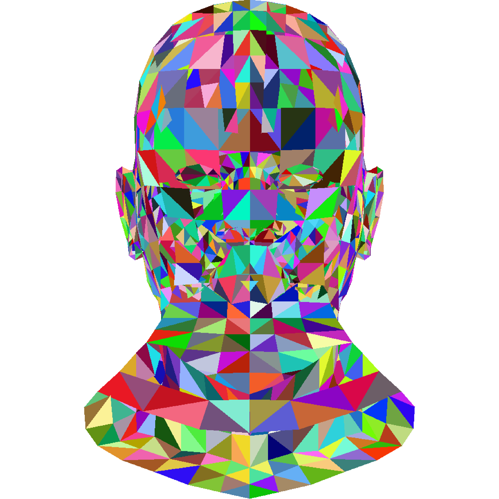
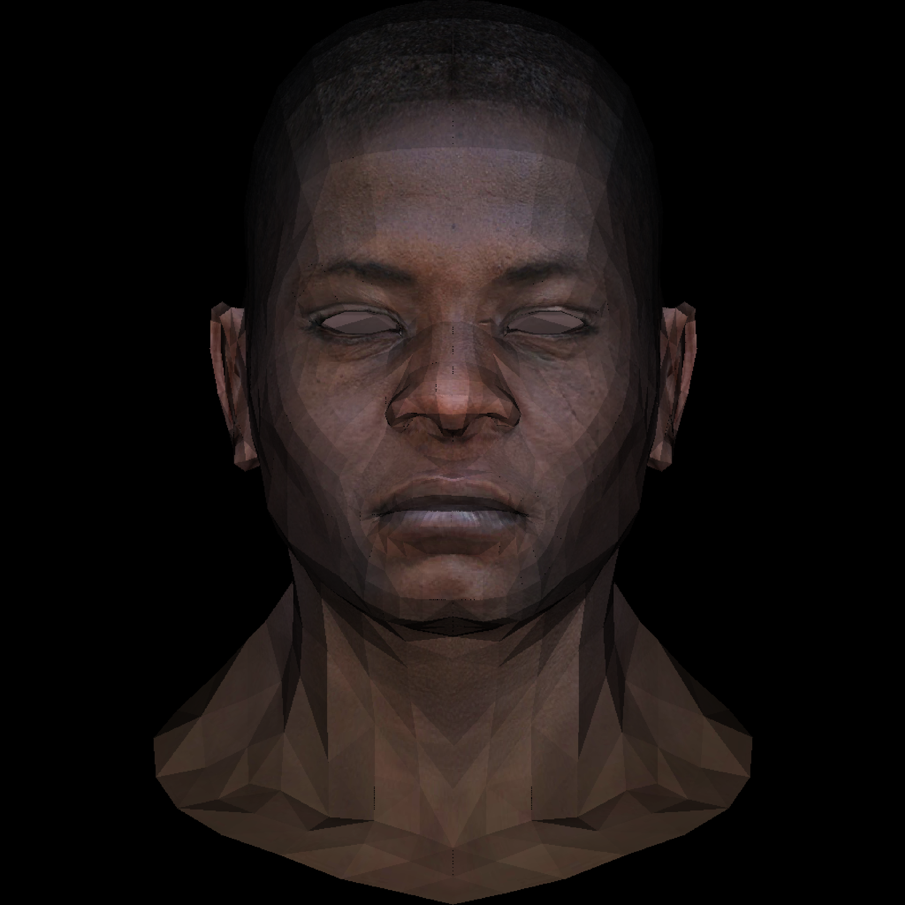

# tinyrenderer
https://github.com/ssloy/tinyrenderer/wiki

## Lesson 1. Bresenham’s Line Drawing Algorithm

## Lesson 2. Triangle Rasterization and Back Face Culling

## Lesson 3. Hidden Faces Removal (Z-Buffer)

